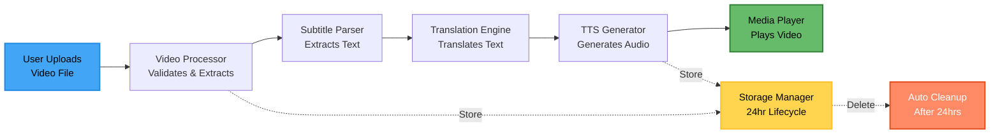

# AI Multilingual Video Translator

> AI-powered video subtitle translation and synchronized audio generation for global accessibility

[](https://github.com)

## Overview

A privacy-first web application that translates video subtitles into multiple languages and generates synchronized text-to-speech audio. Built for content creators, educators, and accessibility advocates who want to make their videos accessible to global audiences.

## Core Features

**Multi-Format Video Support**
- Accepts MP4, MKV, AVI, MOV, WebM (up to 500MB)
- Extracts embedded subtitles automatically using FFmpeg.wasm
- Supports external SRT/VTT subtitle files
- Client-side processing with IndexedDB storage

**AI-Powered Translation**
- Translates into 10+ languages (English, Spanish, French, German, Chinese, Japanese, Arabic, Hindi, Portuguese, Russian)
- Azure AI Translator (primary) with AWS/Google Cloud fallbacks
- Context-aware translation preserving timing and formatting
- Batch processing with caching for efficiency

**Text-to-Speech Audio Generation**
- Generates natural-sounding audio using Azure Speech Services
- Automatic synchronization with subtitle timestamps (±100ms accuracy)
- Language-appropriate voice characteristics
- Adjustable playback speed to fit timing constraints

**Interactive Video Player**
- HTML5 video player with custom controls
- Switch languages during playback without restarting
- Maintains playback position across language changes
- Multi-track audio mixing and subtitle rendering

**Export & Privacy**
- Download translated subtitles in SRT/VTT formats
- UTF-8 encoding for international characters
- Automatic 24-hour data deletion
- HTTPS-only transmission

## Architecture

**Client-Server Hybrid Design**
- Frontend: React 18 + TypeScript + Tailwind CSS
- Backend: Node.js + Express.js
- Video Processing: FFmpeg.wasm (client-side)
- Storage: IndexedDB (client) + S3-compatible (server, 24hr lifecycle)
- Deployment: Vercel (frontend) + Railway (backend)

**Processing Pipeline**



**Key Components**
- Video Processor: File validation and metadata extraction
- Subtitle Parser: SRT/VTT format parsing with round-trip consistency
- Translation Engine: API orchestration with rate limiting and retry logic
- TTS Generator: Speech synthesis with audio synchronization
- Media Player: Multi-language playback with subtitle rendering

## Technology Stack

**Frontend**
- React 18 with TypeScript
- FFmpeg.wasm for video processing
- HTML5 Video API with custom controls
- Tailwind CSS for responsive design
- Vite for build optimization

**Backend**
- Node.js + Express.js
- Azure AI Translator (primary translation service)
- Azure Speech Services (TTS generation)
- S3-compatible storage with lifecycle policies
- Express rate limiter for API protection

**Testing**
- Jest for unit tests (80%+ coverage target)
- Playwright for integration tests
- fast-check for property-based testing (21 correctness properties)
- 100+ iterations per property test

## Quick Start

```bash
# Clone repository
git clone https://github.com/yourusername/video-translation.git
cd video-translation

# Frontend setup
cd frontend
npm install
npm run dev

# Backend setup (separate terminal)
cd backend
npm install
npm run dev

# Access application
# Frontend: http://localhost:3000
# Backend: http://localhost:3001
```

## Workflow

1. **Upload**: Drag-and-drop video file or select from device
2. **Extract**: Automatic subtitle detection and parsing
3. **Translate**: Select target languages and initiate AI translation
4. **Generate**: Optional TTS audio generation with synchronization
5. **Preview**: Review translations in built-in video player
6. **Export**: Download subtitle files in SRT/VTT formats

## Design Principles

**Privacy-First**
- Client-side video processing where possible
- Temporary server storage with 24-hour auto-deletion
- No permanent logging of subtitle content
- Minimal data transfer (only subtitle text to APIs)

**Hackathon-Optimized**
- MVP focus on core translation and playback features
- Realistic limits: 500MB files, 10-minute videos, 5 target languages
- Rapid development using existing libraries and APIs
- Simple environment variable configuration

**Error Handling**
- Graceful degradation (subtitle-only mode if TTS fails)
- Retry logic with exponential backoff (3 attempts)
- Fallback service chain (Azure → AWS → Google → Open Source)
- User-friendly error messages with suggested actions

**Performance**
- Translation: 100+ subtitle entries per minute
- TTS Generation: 50+ entries per minute
- Lazy loading and on-demand processing
- Browser-based caching for translated content

## Correctness Properties

The system implements 21 property-based tests to ensure correctness:

- **Format Validation**: Accept only supported video formats
- **Round-Trip Consistency**: SRT/VTT parsing preserves timing and text
- **Timing Preservation**: Translation maintains original timestamps
- **Synchronization Accuracy**: Subtitles display within 100ms of video time
- **Language Switching**: Maintains playback position across language changes
- **Character Limits**: Respects 42-character subtitle display limits
- **Privacy Guarantees**: 24-hour storage lifecycle enforcement
- **Error Recovery**: Graceful degradation on partial failures

## Contributing

This is a hackathon project built for learning and experimentation. Contributions are welcome!

```bash
git checkout -b feature/your-feature
git commit -m 'Add your feature'
git push origin feature/your-feature
# Open a Pull Request
```


## Acknowledgments

Built for a student hackathon focused on media accessibility, content localization, and AI-powered language technology.

---

**Project Link**: [https://github.com/AadhiKabilan/AI-Multilingual-Video-Translator](https://github.com/AadhiKabilan/AI-Multilingual-Video-Translator)
