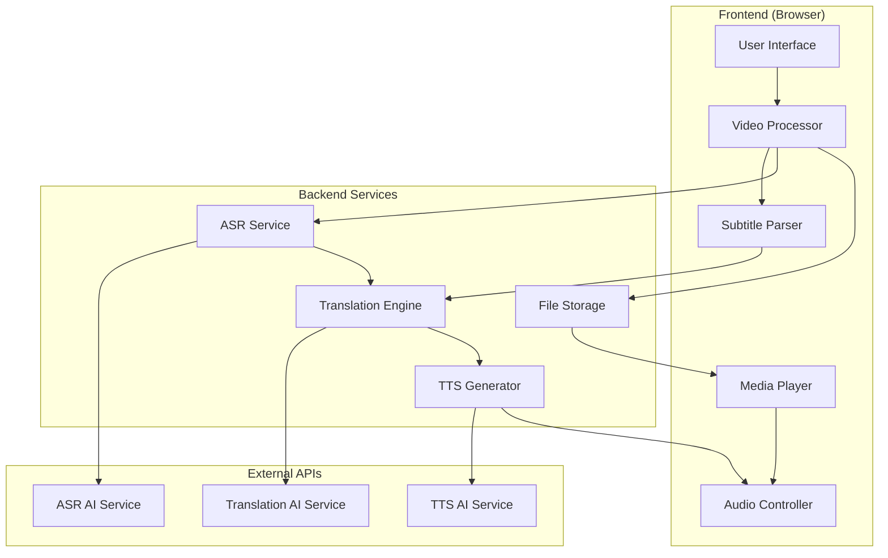

# Design Document

## Overview

The Video Translation System is a client-side web application that processes video files with subtitles, translates them into multiple languages using AI services, and provides synchronized playback with optional text-to-speech audio. The system prioritizes user privacy by processing content locally where possible and using temporary storage for cloud-based AI operations.

The architecture follows a modular design with clear separation between video processing, translation services, audio generation, and playback components. This enables independent development and testing of each component while maintaining a cohesive user experience.

## Architecture

The system uses a **client-server hybrid architecture** where the frontend handles video processing and playback while backend services manage AI translation and TTS generation.



### Component Responsibilities

- **Frontend**: Video upload, subtitle extraction, media playback, user interface
- **Backend**: AI service orchestration, temporary file management, API rate limiting
- **External APIs**: Translation processing, text-to-speech generation

## Components and Interfaces

### 1. Video Processor Component

**Purpose**: Handles video file upload, validation, and metadata extraction.

**Key Functions**:
- `uploadVideo(file: File): Promise<VideoMetadata>`
- `validateFormat(file: File): boolean`
- `extractMetadata(file: File): VideoMetadata`

**Interfaces**:
```typescript
interface VideoMetadata {
  duration: number;
  format: string;
  size: number;
  hasEmbeddedSubtitles: boolean;
  subtitleTracks: SubtitleTrack[];
}

interface SubtitleTrack {
  language: string;
  format: 'srt' | 'vtt' | 'ass';
  content: string;
}
```

### 2. Subtitle Parser Component

**Purpose**: Extracts and parses subtitle data from various formats.

**Key Functions**:
- `parseSubtitles(content: string, format: string): SubtitleSegment[]`
- `extractEmbeddedSubtitles(videoFile: File): SubtitleTrack[]`
- `validateTimestamps(segments: SubtitleSegment[]): boolean`

**Interfaces**:
```typescript
interface SubtitleSegment {
  id: number;
  startTime: number; // milliseconds
  endTime: number;   // milliseconds
  text: string;
  originalText?: string;
}
```

### 3. Translation Engine Component

**Purpose**: Manages AI-powered translation of subtitle content.

**Key Functions**:
- `translateSubtitles(segments: SubtitleSegment[], targetLang: string): Promise<SubtitleSegment[]>`
- `getSupportedLanguages(): Language[]`
- `batchTranslate(texts: string[], targetLang: string): Promise<string[]>`

**Interfaces**:
```typescript
interface Language {
  code: string;
  name: string;
  flag: string;
}

interface TranslationRequest {
  text: string;
  sourceLang: string;
  targetLang: string;
}
```

### 4. TTS Generator Component

**Purpose**: Converts translated text to synchronized speech audio.

**Key Functions**:
- `generateSpeech(segments: SubtitleSegment[], language: string): Promise<AudioTrack>`
- `synchronizeAudio(audioSegments: AudioSegment[], subtitleTiming: number[]): AudioTrack`
- `getAvailableVoices(language: string): Voice[]`

**Interfaces**:
```typescript
interface AudioTrack {
  language: string;
  audioUrl: string;
  segments: AudioSegment[];
}

interface AudioSegment {
  startTime: number;
  endTime: number;
  audioData: Blob;
}

interface Voice {
  id: string;
  name: string;
  gender: 'male' | 'female';
  language: string;
}
```

### 5. Media Player Component

**Purpose**: Provides video playback with multi-language subtitle and audio support.

**Key Functions**:
- `loadVideo(videoUrl: string, subtitles: SubtitleTrack[], audioTracks: AudioTrack[]): void`
- `switchLanguage(languageCode: string): void`
- `toggleAudio(enabled: boolean): void`
- `syncSubtitles(currentTime: number): void`

**Interfaces**:
```typescript
interface PlayerState {
  currentTime: number;
  duration: number;
  isPlaying: boolean;
  currentLanguage: string;
  audioEnabled: boolean;
  volume: number;
}
```

## Data Models

### Core Data Structures

```typescript
// Main video project structure
interface VideoProject {
  id: string;
  originalVideo: VideoFile;
  subtitles: Map<string, SubtitleTrack>; // language code -> track
  audioTracks: Map<string, AudioTrack>;  // language code -> audio
  metadata: ProjectMetadata;
  createdAt: Date;
  expiresAt: Date;
}

interface VideoFile {
  name: string;
  size: number;
  format: string;
  url: string;
  duration: number;
}

interface ProjectMetadata {
  title: string;
  originalLanguage: string;
  availableLanguages: string[];
  processingStatus: ProcessingStatus;
}

enum ProcessingStatus {
  UPLOADED = 'uploaded',
  EXTRACTING_SUBTITLES = 'extracting_subtitles',
  TRANSLATING = 'translating',
  GENERATING_AUDIO = 'generating_audio',
  COMPLETE = 'complete',
  ERROR = 'error'
}
```

### Storage Schema

```typescript
// Temporary storage structure (24-hour lifecycle)
interface StorageSchema {
  projects: {
    [projectId: string]: {
      videoFile: Blob;
      subtitleTracks: SubtitleTrack[];
      audioTracks: AudioTrack[];
      metadata: ProjectMetadata;
      createdAt: number;
    }
  };
}
```

- Temporary files are stored with server-side encryption enabled (e.g., SSE-S3). Objects have lifecycle rules to delete them after 24 hours. Access to these objects is restricted to the processing service and is auditable.

## Technology Stack

### Frontend Technologies
MVP implementation choice for the hackathon: React (frontend) + Node.js / Express (backend). Alternate: React + Python (FastAPI) if team prefers Python.

- **Framework**: React 18 with TypeScript for type safety and component reusability
- **Video Processing**: [FFmpeg.wasm](https://ffmpegwasm.netlify.app/) for client-side video manipulation and subtitle extraction
- **Media Player**: HTML5 Video API with custom controls for subtitle and audio track management
- **Subtitle Parsing**: Custom parsers for SRT/VTT formats with [subtitle.js](https://github.com/gsantiago/subtitle.js) as fallback
- **File Upload**: HTML5 File API with drag-and-drop support
- **State Management**: React Context API for application state
- **Styling**: Tailwind CSS for responsive design

### Backend Technologies
- **Runtime**: Node.js with Express.js for API endpoints
- **Translation Service**: Primary — Azure AI Translator (supports 100+ languages). Fallbacks — AWS Translate, Google Cloud Translate, or open-source models (HuggingFace) if required
- **Text-to-Speech**: 
  - Browser Web Speech API (client-side, free)
  - Azure Cognitive Services Speech (server-side, higher quality)
- **File Storage**:
  - Client-side: IndexedDB for temporary in-browser storage (when performing client-side extraction)
  - Server-side: Object storage (e.g., S3-compatible) for temporary files. Server-side storage uses server-side encryption and lifecycle policies to delete objects after 24 hours. (Memory-only storage is not used for production; ephemeral memory buffers may be used during processing but are not relied upon for persistence)
- **API Rate Limiting**: Express rate limiter for translation API protection

### External Services
- **Translation**: Primary — Azure AI Translator (supports 100+ languages). Fallbacks — AWS Translate, Google Cloud Translate, or open-source models (HuggingFace) if required
- **TTS (Optional)**: Primary — Azure Speech Services. Alternatives — AWS Polly, Google Cloud TTS, or open-source TTS (Coqui). Select voice engines that support the required Indian languages

### Development Tools
- **Build Tool**: Vite for fast development and optimized builds
- **Testing**: Jest for unit tests, Playwright for integration tests
- **Code Quality**: ESLint, Prettier, TypeScript strict mode
- **Deployment**: Vercel for frontend, Railway for backend services

Note: Production requires API keys for chosen translation/TTS providers; costs vary by provider and should be estimated during production planning.

### How to run locally (MVP)
```bash
# Frontend
cd frontend && npm install && npm run dev
# Backend
cd backend && npm install && npm run dev
# Open http://localhost:3000
```

## Design Goals

### 1. Privacy-First Architecture
- **Client-side Processing**: Video files remain in browser memory/IndexedDB when possible
- **Temporary Storage**: All server-side data automatically deleted after 24 hours
- **No Permanent Logging**: Subtitle content not stored in application logs
- **Minimal Data Transfer**: Only subtitle text sent to translation APIs, not video files

### 2. Hackathon-Optimized Scope
- **Rapid Development**: Use existing libraries and APIs rather than building from scratch
- **MVP Focus**: Core translation and playback features prioritized over advanced editing
- **Realistic Limits**: 100MB file size, 10-minute video length, 5 target languages (plus English as default)
- **Quick Setup**: Environment variables for API keys, no complex infrastructure

### 3. Accessibility and Usability
- **Intuitive Interface**: Drag-and-drop upload, clear progress indicators
- **Multiple Input Methods**: Support for embedded subtitles and external files
- **Responsive Design**: Works on desktop and tablet devices
- **Error Recovery**: Graceful handling of API failures with user-friendly messages

### 4. Performance Optimization
- **Lazy Loading**: Translation and TTS generation on-demand per language
- **Caching Strategy**: Translated content cached in browser session
- **Batch Processing**: Multiple subtitle segments translated in single API calls
- **Progressive Enhancement**: Basic subtitle display works without TTS

### 5. Extensibility
- **Modular Components**: Each service can be independently upgraded or replaced
- **API Abstraction**: Translation and TTS services behind interfaces for easy swapping
- **Language Support**: Architecture supports adding new languages without code changes
- **Format Support**: Subtitle parser designed to handle additional formats (ASS, SCC)

## Error Handling

### Translation Service Failures
- **Primary/Fallback Strategy**: Azure AI Translator with Google Translate backup
- **Partial Failure Recovery**: Continue with successfully translated segments
- **Rate Limit Handling**: API rate limit handling: perform up to 3 retries with exponential backoff (e.g., 1s, 2s, 4s). If still failing, surface a clear error to the user and offer a retry button
- **Network Resilience**: Retry logic with timeout handling

### File Processing Errors
- **Format Validation**: Clear error messages for unsupported formats
- **Size Limit Enforcement**: Progress indication with size warnings
- **Corruption Detection**: File integrity checks before processing
- **Memory Management**: Cleanup of large files on processing failure

### TTS Generation Issues
- **Graceful Degradation**: Continue with subtitle-only mode if TTS fails
- **Voice Availability**: Fallback to default system voices
- **Synchronization Errors**: Skip problematic segments rather than failing entirely
- **Browser Compatibility**: Feature detection for Web Speech API support

## Testing Strategy

Testing for the hackathon MVP: unit tests for core logic and 2 end-to-end sample flows (upload → translate → TTS → playback). Property-based or load testing are future work.

The testing approach combines unit tests for individual components with property-based tests for universal correctness guarantees, ensuring both specific functionality and general system reliability.

### Unit Testing Focus
- **Component Integration**: Test interactions between video processor and subtitle parser
- **API Error Handling**: Verify graceful degradation when translation services fail
- **File Format Support**: Validate parsing of various subtitle formats (SRT, VTT)
- **Edge Cases**: Empty files, corrupted subtitles, network timeouts
- **Browser Compatibility**: Test Web Speech API availability and fallbacks

### Property-Based Testing Configuration
- **Testing Library**: [fast-check](https://github.com/dubzzz/fast-check) for JavaScript property testing
- **Test Iterations**: Minimum 100 iterations per property test for thorough coverage
- **Property Tagging**: Each test tagged with format: **Feature: video-translation, Property {number}: {description}**
- **Generator Strategy**: Custom generators for subtitle segments, video metadata, and translation responses

## Correctness Properties

*A property is a characteristic or behavior that should hold true across all valid executions of a system—essentially, a formal statement about what the system should do. Properties serve as the bridge between human-readable specifications and machine-verifiable correctness guarantees.*

### Property 1: Video Format Validation
*For any* uploaded file, the system should accept the file if and only if it has a valid video format (MP4, AVI, MOV, WebM) and is under the 100MB size limit
**Validates: Requirements 1.1, 6.1**

### Property 2: Subtitle Parsing Round Trip
*For any* valid SRT or VTT subtitle file, parsing the content and then formatting it back should preserve the essential timing and text information
**Validates: Requirements 1.3, 6.3**

### Property 3: Translation Timing Preservation
*For any* set of subtitle segments, after translation to any supported language, the start and end times of each segment should remain unchanged
**Validates: Requirements 2.2, 2.3**

### Property 4: Language Support Consistency
*For any* processed video, the available language options should include all successfully translated languages and exclude any that failed translation
**Validates: Requirements 2.1, 4.1**

### Property 5: TTS Audio Synchronization
*For any* generated TTS audio track, each audio segment should have timing that aligns with its corresponding subtitle segment within acceptable tolerance (±100ms)
**Validates: Requirements 3.2, 3.3**

### Property 6: Language Switching Continuity
*For any* playback position and any available language, switching languages should maintain the current playback time and display the correct subtitle for that moment
**Validates: Requirements 4.2, 4.4**

### Property 7: Audio Volume Independence
*For any* media player state with both video audio and TTS audio, adjusting the volume of one audio source should not affect the volume of the other
**Validates: Requirements 3.5**

### Property 8: Progress Tracking Completeness
*For any* video processing workflow, the progress indicator should advance through all required stages (upload → subtitle extraction → translation → TTS generation → complete) without skipping or repeating stages
**Validates: Requirements 5.1, 5.2, 5.4**

### Property 9: Temporary Storage Lifecycle
*For any* uploaded video file, the file should be automatically removed from storage after 24 hours, and no permanent copies should exist beyond the processing session
**Validates: Requirements 6.5, 8.1, 8.2**

### Property 10: Subtitle Content Privacy
*For any* subtitle text processed by the system, the content should not appear in application logs or permanent storage beyond the active processing session
**Validates: Requirements 8.5**

### Property 11: Processing State Consistency
*For any* video in processing state, the UI should prevent conflicting actions (like starting new processing) until the current operation completes or fails
**Validates: Requirements 7.2**

### Property 12: Error Recovery Graceful Degradation
*For any* translation or TTS generation failure, the system should continue operating with available features rather than completely failing
**Validates: Requirements 2.4, 3.4**