# Design Document

## Overview

The Video Translation System is a client-side web application that processes video files with subtitles, translates them into multiple languages using AI services, and provides synchronized playback with optional text-to-speech audio. The system prioritizes user privacy by processing content locally where possible and using temporary storage for cloud-based AI operations.

The architecture follows a modular design with clear separation between video processing, translation services, audio generation, and playback components. This enables independent development and testing of each component while maintaining a cohesive user experience.

## Architecture

The system uses a **client-server hybrid architecture** where the frontend handles video processing and playback while backend services manage AI translation and TTS generation.


### Component Responsibilities

- **Frontend**: Video upload, subtitle extraction, media playback, user interface
- **Backend**: AI service orchestration, temporary file management, API rate limiting
- **External APIs**: Translation processing, text-to-speech generation

### Processing Workflow


### Data Flow Diagram

```mermaid
flowchart TD
    subgraph User["👤 User Action"]
        A["Upload Video<br/>& Subtitles"]
    end
    
    subgraph Frontend["🖥️ Frontend Processing"]
        B["Video Validation"]
        C["Subtitle Extraction"]
        D["Session Storage<br/>IndexedDB"]
    end
    
    subgraph Backend["⚙️ Backend Processing"]
        E["Translation API<br/>Orchestration"]
        F["TTS Generation<br/>Coordination"]
        G["Temporary Storage<br/>S3-compatible"]
    end
    
    subgraph External["☁️ External Services"]
        H["Translation AI<br/>Azure/AWS/GCP"]
        I["TTS Service<br/>Azure/AWS/Coqui"]
    end
    
    subgraph Player["▶️ Playback"]
        J["Media Player<br/>with Controls"]
        K["Subtitle Rendering"]
        L["Audio Mixing"]
    end
    
    A --> B
    B --> C
    C --> D
    D -->|Subtitle Text| E
    E -->|Request| H
    H -->|Translated Text| E
    E --> G
    
    G -->|Translated Segments| F
    F -->|Request| I
    I -->|Audio Blob| F
    F --> G
    
    G -->|Load| J
    J --> K
    J --> L
    
    style User fill:#42a5f5,stroke:#1e88e5,stroke-width:2px,color:#000
    style Frontend fill:#ab47bc,stroke:#6a1b9a,stroke-width:2px,color:#fff
    style Backend fill:#ffa726,stroke:#f57c00,stroke-width:2px,color:#000
    style External fill:#ec407a,stroke:#c2185b,stroke-width:2px,color:#fff
    style Player fill:#66bb6a,stroke:#2e7d32,stroke-width:2px,color:#000

## Components and Interfaces

### User Interaction Flow - Sequence Diagram

```mermaid
sequenceDiagram
    participant User
    participant UI as UI Component
    participant VP as Video Processor
    participant SP as Subtitle Parser
    participant TE as Translation Engine
    participant TTS as TTS Generator
    participant MP as Media Player
    participant API as External APIs
    
    User->>UI: Upload Video File
    UI->>VP: validateFormat()
    VP-->>UI: ✓ Valid
    
    UI->>SP: extractSubtitles()
    SP-->>UI: SubtitleSegments[]
    
    User->>UI: Select Target Language
    UI->>TE: translateSubtitles()
    TE->>API: POST /translate
    API-->>TE: Translated Text
    TE-->>UI: Translated Segments
    
    opt User Selects TTS
        UI->>TTS: generateSpeech()
        TTS->>API: POST /synthesize
        API-->>TTS: Audio Blob
        TTS-->>UI: AudioTrack
    end
    
    UI->>MP: loadVideo()
    MP->>MP: renderSubtitles()
    MP->>MP: mixAudio()
    MP-->>User: ▶️ Playing with Subtitles
    
    User->>MP: switchLanguage()
    MP->>MP: Update Subtitles
    MP-->>User: Display New Language
```

### Processing State Machine


### Component Dependencies and Interactions

```mermaid
graph TB
    UI["🎨 User Interface<br/>React Components"]
    
    subgraph "Processing Layer"
        VP["📹 Video Processor<br/>Handles file upload<br/>& validation"]
        SP["📄 Subtitle Parser<br/>Extracts text<br/>from video/files"]
    end
    
    subgraph "Translation Layer"
        TE["🌐 Translation Engine<br/>Manages translation<br/>requests & caching"]
        TL["🔄 Translation Layer<br/>API abstraction"]
    end
    
    subgraph "Audio Layer"
        TTS["🔊 TTS Generator<br/>Converts text<br/>to speech"]
        AL["🎵 Audio Layer<br/>API abstraction"]
    end
    
    subgraph "Playback Layer"
        MP["▶️ Media Player<br/>HTML5 video<br/>with controls"]
        AC["🔉 Audio Controller<br/>Manages audio<br/>mixing & sync"]
    end
    
    subgraph "Storage Layer"
        IDB["💾 IndexedDB<br/>Client-side cache"]
        S3["☁️ S3 Storage<br/>Temporary files<br/>24hr lifecycle"]
    end
    
    subgraph "External APIs"
        TLAPI["Translation API"]
        TTSAPI["TTS API"]
    end
    
    UI --> VP
    UI --> SP
    UI --> TE
    UI --> TTS
    UI --> MP
    
    VP --> IDB
    SP --> IDB
    
    TE --> TL
    TL --> TLAPI
    TE --> IDB
    
    TTS --> AL
    AL --> TTSAPI
    TTS --> S3
    
    MP --> AC
    AC --> IDB
    AC --> S3
    
    style UI fill:#42a5f5,stroke:#1e88e5,stroke-width:2px,color:#000
    style VP fill:#66bb6a,stroke:#2e7d32,stroke-width:2px,color:#000
    style SP fill:#66bb6a,stroke:#2e7d32,stroke-width:2px,color:#000
    style TE fill:#ffd54f,stroke:#fbc02d,stroke-width:2px,color:#000
    style TTS fill:#ffb74d,stroke:#f57c00,stroke-width:2px,color:#000
    style MP fill:#f06292,stroke:#c2185b,stroke-width:2px,color:#fff
    style IDB fill:#9575cd,stroke:#512da8,stroke-width:2px,color:#fff
    style S3 fill:#9575cd,stroke:#512da8,stroke-width:2px,color:#fff
    style TLAPI fill:#64b5f6,stroke:#1565c0,stroke-width:2px,color:#000
    style TTSAPI fill:#64b5f6,stroke:#1565c0,stroke-width:2px,color:#000
```



### 1. Video Processor Component

**Purpose**: Handles video file upload, validation, and metadata extraction.

**Key Functions**:
- `uploadVideo(file: File): Promise<VideoMetadata>`
- `validateFormat(file: File): boolean`
- `extractMetadata(file: File): VideoMetadata`

**Interfaces**:
```typescript
interface VideoMetadata {
  duration: number;
  format: string;
  size: number;
  hasEmbeddedSubtitles: boolean;
  subtitleTracks: SubtitleTrack[];
}

interface SubtitleTrack {
  language: string;
  format: 'srt' | 'vtt' | 'ass';
  content: string;
}
```

### 2. Subtitle Parser Component

**Purpose**: Extracts and parses subtitle data from various formats.

**Key Functions**:
- `parseSubtitles(content: string, format: string): SubtitleSegment[]`
- `extractEmbeddedSubtitles(videoFile: File): SubtitleTrack[]`
- `validateTimestamps(segments: SubtitleSegment[]): boolean`

**Interfaces**:
```typescript
interface SubtitleSegment {
  id: number;
  startTime: number; // milliseconds
  endTime: number;   // milliseconds
  text: string;
  originalText?: string;
}
```

### 3. Translation Engine Component

**Purpose**: Manages AI-powered translation of subtitle content.

**Key Functions**:
- `translateSubtitles(segments: SubtitleSegment[], targetLang: string): Promise<SubtitleSegment[]>`
- `getSupportedLanguages(): Language[]`
- `batchTranslate(texts: string[], targetLang: string): Promise<string[]>`

**Interfaces**:
```typescript
interface Language {
  code: string;
  name: string;
  flag: string;
}

interface TranslationRequest {
  text: string;
  sourceLang: string;
  targetLang: string;
}
```

### 4. TTS Generator Component

**Purpose**: Converts translated text to synchronized speech audio.

**Key Functions**:
- `generateSpeech(segments: SubtitleSegment[], language: string): Promise<AudioTrack>`
- `synchronizeAudio(audioSegments: AudioSegment[], subtitleTiming: number[]): AudioTrack`
- `getAvailableVoices(language: string): Voice[]`

**Interfaces**:
```typescript
interface AudioTrack {
  language: string;
  audioUrl: string;
  segments: AudioSegment[];
}

interface AudioSegment {
  startTime: number;
  endTime: number;
  audioData: Blob;
}

interface Voice {
  id: string;
  name: string;
  gender: 'male' | 'female';
  language: string;
}
```

### 5. Media Player Component

**Purpose**: Provides video playback with multi-language subtitle and audio support.

**Key Functions**:
- `loadVideo(videoUrl: string, subtitles: SubtitleTrack[], audioTracks: AudioTrack[]): void`
- `switchLanguage(languageCode: string): void`
- `toggleAudio(enabled: boolean): void`
- `syncSubtitles(currentTime: number): void`

**Interfaces**:
```typescript
interface PlayerState {
  currentTime: number;
  duration: number;
  isPlaying: boolean;
  currentLanguage: string;
  audioEnabled: boolean;
  volume: number;
}
```

## Data Models

### Storage Lifecycle Diagram


### API Request/Response Flow

```mermaid
graph LR
    A["Frontend<br/>Translation Request"] -->|1. Send Subtitles| B["Rate Limiter<br/>Check Quota"]
    
    B -->|Allowed| C["Translation Service<br/>Queue Request"]
    B -->|Rejected| D["❌ Rate Limited<br/>Return 429"]
    
    C -->|Batch | E["External AI API<br/>Process"]
    E -->|Translated| F["Response Handler<br/>Parse & Cache"]
    F -->|Store| G["Browser Cache<br/>Session Storage"]
    G -->|Return| H["UI Update<br/>Display Results"]
    
    E -->|Network Error| I["Retry Handler<br/>Exponential Backoff"]
    I -->|Retry 1-3| E
    I -->|All Failed| J["❌ Error Handler<br/>User Notification"]
    
    D --> K["⏳ Queue Manager<br/>Retry Later"]
    K -->|After Cooldown| B
    
    J --> K
    
    style D fill:#ef5350,stroke:#c62828,stroke-width:2px,color:#fff
    style J fill:#ef5350,stroke:#c62828,stroke-width:2px,color:#fff
    style B fill:#ffd54f,stroke:#fbc02d,stroke-width:2px,color:#000
    style K fill:#ffd54f,stroke:#fbc02d,stroke-width:2px,color:#000
    style H fill:#66bb6a,stroke:#2e7d32,stroke-width:2px,color:#000
```



### Core Data Structures

```typescript
// Main video project structure
interface VideoProject {
  id: string;
  originalVideo: VideoFile;
  subtitles: Map<string, SubtitleTrack>; // language code -> track
  audioTracks: Map<string, AudioTrack>;  // language code -> audio
  metadata: ProjectMetadata;
  createdAt: Date;
  expiresAt: Date;
}

interface VideoFile {
  name: string;
  size: number;
  format: string;
  url: string;
  duration: number;
}

interface ProjectMetadata {
  title: string;
  originalLanguage: string;
  availableLanguages: string[];
  processingStatus: ProcessingStatus;
}

enum ProcessingStatus {
  UPLOADED = 'uploaded',
  EXTRACTING_SUBTITLES = 'extracting_subtitles',
  TRANSLATING = 'translating',
  GENERATING_AUDIO = 'generating_audio',
  COMPLETE = 'complete',
  ERROR = 'error'
}
```

### Storage Schema

```typescript
// Temporary storage structure (24-hour lifecycle)
interface StorageSchema {
  projects: {
    [projectId: string]: {
      videoFile: Blob;
      subtitleTracks: SubtitleTrack[];
      audioTracks: AudioTrack[];
      metadata: ProjectMetadata;
      createdAt: number;
    }
  };
}
```

- Temporary files are stored with server-side encryption enabled (e.g., SSE-S3). Objects have lifecycle rules to delete them after 24 hours. Access to these objects is restricted to the processing service and is auditable.

## Technology Stack

### Frontend Technologies
MVP implementation choice for the hackathon: React (frontend) + Node.js / Express (backend). Alternate: React + Python (FastAPI) if team prefers Python.

- **Framework**: React 18 with TypeScript for type safety and component reusability
- **Video Processing**: [FFmpeg.wasm](https://ffmpegwasm.netlify.app/) for client-side video manipulation and subtitle extraction
- **Media Player**: HTML5 Video API with custom controls for subtitle and audio track management
- **Subtitle Parsing**: Custom parsers for SRT/VTT formats with [subtitle.js](https://github.com/gsantiago/subtitle.js) as fallback
- **File Upload**: HTML5 File API with drag-and-drop support
- **State Management**: React Context API for application state
- **Styling**: Tailwind CSS for responsive design

### Backend Technologies
- **Runtime**: Node.js with Express.js for API endpoints
- **Translation Service**: Primary — Azure AI Translator (supports 100+ languages). Fallbacks — AWS Translate, Google Cloud Translate, or open-source models (HuggingFace) if required
- **Text-to-Speech**: 
  - Browser Web Speech API (client-side, free)
  - Azure Cognitive Services Speech (server-side, higher quality)
- **File Storage**:
  - Client-side: IndexedDB for temporary in-browser storage (when performing client-side extraction)
  - Server-side: Object storage (e.g., S3-compatible) for temporary files. Server-side storage uses server-side encryption and lifecycle policies to delete objects after 24 hours. (Memory-only storage is not used for production; ephemeral memory buffers may be used during processing but are not relied upon for persistence)
- **API Rate Limiting**: Express rate limiter for translation API protection

### External Services
- **Translation**: Primary — Azure AI Translator (supports 100+ languages). Fallbacks — AWS Translate, Google Cloud Translate, or open-source models (HuggingFace) if required
- **TTS (Optional)**: Primary — Azure Speech Services. Alternatives — AWS Polly, Google Cloud TTS, or open-source TTS (Coqui). Select voice engines that support the required Indian languages

### Development Tools
- **Build Tool**: Vite for fast development and optimized builds
- **Testing**: Jest for unit tests, Playwright for integration tests
- **Code Quality**: ESLint, Prettier, TypeScript strict mode
- **Deployment**: Vercel for frontend, Railway for backend services

### How to run locally (MVP)
```bash
# Frontend
cd frontend && npm install && npm run dev
# Backend
cd backend && npm install && npm run dev
# Open http://localhost:3000
```

### Deployment Architecture

```mermaid
graph TB
    subgraph Local["🖥️ Local Development"]
        LFE["Frontend<br/>React Dev Server<br/>:3000"]
        LBE["Backend<br/>Express Dev Server<br/>:3001"]
        LIDB["IndexedDB<br/>Browser Storage"]
    end
    
    subgraph Prod["☁️ Production Deployment"]
        subgraph Vercel["Vercel (Frontend)"]
            FE["React App<br/>CDN Optimized<br/>Auto-scaling"]
        end
        
        subgraph Railway["Railway (Backend)"]
            BE["Express API<br/>Node.js Runtime<br/>Auto-scaling"]
            Cache["Redis Cache<br/>Session Store"]
        end
        
        subgraph AWS["AWS Services"]
            S3["S3 Bucket<br/>Temporary Storage<br/>24hr Lifecycle"]
            IAM["IAM Roles<br/>Access Control"]
        end
    end
    
    subgraph Ext["☁️ External APIs"]
        Azure["Azure AI Translator<br/>Primary"]
        AWS_Trans["AWS Translate<br/>Fallback"]
        GCP["Google Translate<br/>Fallback"]
        Coqui["Coqui TTS<br/>Open Source"]
        Speech["Azure Speech<br/>Premium TTS"]
    end
    
    LFE -.->|npm run dev| LBE
    LIDB <-.->|Session| LFE
    
    FE <-->|API Calls| BE
    BE <-->|Session| Cache
    BE <-->|Store/Retrieve| S3
    BE <-->|Auth| IAM
    
    BE -->|Translate| Azure
    Azure -->|Fallback| AWS_Trans
    AWS_Trans -->|Fallback| GCP
    
    BE -->|TTS| Speech
    Speech -->|Fallback| Coqui
    
    style LFE fill:#42a5f5,stroke:#1e88e5,stroke-width:2px,color:#000
    style LBE fill:#ab47bc,stroke:#6a1b9a,stroke-width:2px,color:#fff
    style FE fill:#42a5f5,stroke:#1e88e5,stroke-width:2px,color:#000
    style BE fill:#ab47bc,stroke:#6a1b9a,stroke-width:2px,color:#fff
    style S3 fill:#ffa726,stroke:#f57c00,stroke-width:2px,color:#000
    style Azure fill:#f06292,stroke:#c2185b,stroke-width:2px,color:#fff
```



## Design Goals

### 1. Privacy-First Architecture
- **Client-side Processing**: Video files remain in browser memory/IndexedDB when possible
- **Temporary Storage**: All server-side data automatically deleted after 24 hours
- **No Permanent Logging**: Subtitle content not stored in application logs
- **Minimal Data Transfer**: Only subtitle text sent to translation APIs, not video files

### 2. Hackathon-Optimized Scope
- **Rapid Development**: Use existing libraries and APIs rather than building from scratch
- **MVP Focus**: Core translation and playback features prioritized over advanced editing
- **Realistic Limits**: 100MB file size, 10-minute video length, 5 target languages (plus English as default)
- **Quick Setup**: Environment variables for API keys, no complex infrastructure

### 3. Accessibility and Usability
- **Intuitive Interface**: Drag-and-drop upload, clear progress indicators
- **Multiple Input Methods**: Support for embedded subtitles and external files
- **Responsive Design**: Works on desktop and tablet devices
- **Error Recovery**: Graceful handling of API failures with user-friendly messages

### 4. Performance Optimization
- **Lazy Loading**: Translation and TTS generation on-demand per language
- **Caching Strategy**: Translated content cached in browser session
- **Batch Processing**: Multiple subtitle segments translated in single API calls
- **Progressive Enhancement**: Basic subtitle display works without TTS

### 5. Extensibility
- **Modular Components**: Each service can be independently upgraded or replaced
- **API Abstraction**: Translation and TTS services behind interfaces for easy swapping
- **Language Support**: Architecture supports adding new languages without code changes
- **Format Support**: Subtitle parser designed to handle additional formats (ASS, SCC)

## Error Handling

### Error Recovery Flow


### Fallback Strategy Chain

```mermaid
graph LR
    A["Translation Request"] --> B["Primary:<br/>Azure AI Translator<br/>100+ languages"]
    
    B -->|Success| D["✅ Return"]
    B -->|Failure| C["Secondary:<br/>AWS Translate<br/>Fallback languages"]
    
    C -->|Success| D
    C -->|Failure| E["Tertiary:<br/>Google Cloud<br/>If available"]
    
    E -->|Success| D
    E -->|Failure| F["Quaternary:<br/>Open Source<br/>HuggingFace Model"]
    
    F -->|Success| D
    F -->|All Failed| G["❌ User Notified<br/>Manual Retry"]
    
    style B fill:#42a5f5,stroke:#1e88e5,stroke-width:2px,color:#000
    style C fill:#64b5f6,stroke:#1565c0,stroke-width:2px,color:#000
    style E fill:#42a5f5,stroke:#1e88e5,stroke-width:2px,color:#000
    style F fill:#42a5f5,stroke:#1e88e5,stroke-width:2px,color:#000
    style D fill:#66bb6a,stroke:#2e7d32,stroke-width:2px,color:#000
    style G fill:#ef5350,stroke:#c62828,stroke-width:2px,color:#fff
```



## Error Handling Details
- **Primary/Fallback Strategy**: Azure AI Translator with Google Translate backup
- **Partial Failure Recovery**: Continue with successfully translated segments
- **Rate Limit Handling**: API rate limit handling: perform up to 3 retries with exponential backoff (e.g., 1s, 2s, 4s). If still failing, surface a clear error to the user and offer a retry button
- **Network Resilience**: Retry logic with timeout handling

### File Processing Errors
- **Format Validation**: Clear error messages for unsupported formats
- **Size Limit Enforcement**: Progress indication with size warnings
- **Corruption Detection**: File integrity checks before processing
- **Memory Management**: Cleanup of large files on processing failure

### TTS Generation Issues
- **Graceful Degradation**: Continue with subtitle-only mode if TTS fails
- **Voice Availability**: Fallback to default system voices
- **Synchronization Errors**: Skip problematic segments rather than failing entirely
- **Browser Compatibility**: Feature detection for Web Speech API support

## Testing Strategy

### Test Coverage Pyramid and Flow

```mermaid
graph TB
    subgraph Pyramid["Test Coverage Pyramid"]
        direction LR
        A["📊 E2E Tests<br/>2 sample flows<br/>Video → Translation → TTS → Play"]
        B["🔗 Integration Tests<br/>Component interactions<br/>API rate limiting<br/>Storage lifecycle"]
        C["🧪 Unit Tests<br/>100+ test cases<br/>Format parsing<br/>Error handling"]
    end
    
    subgraph Properties["Property-Based Tests<br/>fast-check library<br/>100+ iterations each"]
        P1["Property 1-4:<br/>Format & Parsing"]
        P2["Property 5-7:<br/>Synchronization"]
        P3["Property 8-10:<br/>State & Lifecycle"]
        P4["Property 11-12:<br/>Error Recovery"]
    end
    
    subgraph Coverage["Coverage Goals"]
        CP["Critical Paths: 95%+<br/>All Components: 80%+<br/>Error Handlers: 90%+"]
    end
    
    A -.-> B
    B -.-> C
    
    C --> Properties
    Properties --> Coverage
    
    style A fill:#ffb74d,stroke:#f57c00,stroke-width:2px,color:#000
    style B fill:#ffd54f,stroke:#fbc02d,stroke-width:2px,color:#000
    style C fill:#66bb6a,stroke:#2e7d32,stroke-width:2px,color:#000
    style P1 fill:#42a5f5,stroke:#1e88e5,stroke-width:2px,color:#000
    style P2 fill:#42a5f5,stroke:#1e88e5,stroke-width:2px,color:#000
    style P3 fill:#42a5f5,stroke:#1e88e5,stroke-width:2px,color:#000
    style P4 fill:#42a5f5,stroke:#1e88e5,stroke-width:2px,color:#000
    style CP fill:#66bb6a,stroke:#2e7d32,stroke-width:2px,color:#000
```



### Testing Workflow Pipeline

```mermaid
sequenceDiagram
    participant Dev as Developer
    participant Unit as Unit Tests<br/>Jest
    participant Int as Integration Tests<br/>Playwright
    participant E2E as E2E Tests<br/>2 Flows
    participant Prop as Property Tests<br/>fast-check
    participant Coverage as Coverage Report
    
    Dev->>Unit: npm run test:unit
    Unit-->>Dev: ✅ All tests pass
    
    Dev->>Int: npm run test:integration
    Int->>Int: Component interactions
    Int-->>Dev: ✅ Integrations OK
    
    Dev->>E2E: npm run test:e2e
    E2E->>E2E: Upload → Translate → TTS → Play
    E2E-->>Dev: ✅ Both flows work
    
    Dev->>Prop: npm run test:properties
    Prop->>Prop: Run 100+ iterations<br/>per property
    Prop-->>Dev: ✅ No property violations
    
    Dev->>Coverage: npm run coverage
    Coverage-->>Dev: 80%+ coverage report
    
    alt All Tests Pass
        Dev->>Dev: ✅ Ready to commit
    else Tests Fail
        Dev->>Dev: 🔧 Fix & Retry
    end
```



## Testing Strategy Details

The testing approach combines unit tests for individual components with property-based tests for universal correctness guarantees, ensuring both specific functionality and general system reliability.

### Unit Testing Focus
- **Component Integration**: Test interactions between video processor and subtitle parser
- **API Error Handling**: Verify graceful degradation when translation services fail
- **File Format Support**: Validate parsing of various subtitle formats (SRT, VTT)
- **Edge Cases**: Empty files, corrupted subtitles, network timeouts
- **Browser Compatibility**: Test Web Speech API availability and fallbacks

### Property-Based Testing Configuration
- **Testing Library**: [fast-check](https://github.com/dubzzz/fast-check) for JavaScript property testing
- **Test Iterations**: Minimum 100 iterations per property test for thorough coverage
- **Property Tagging**: Each test tagged with format: **Feature: video-translation, Property {number}: {description}**
- **Generator Strategy**: Custom generators for subtitle segments, video metadata, and translation responses

## Correctness Properties

*A property is a characteristic or behavior that should hold true across all valid executions of a system—essentially, a formal statement about what the system should do. Properties serve as the bridge between human-readable specifications and machine-verifiable correctness guarantees.*

### Property 1: Video Format Validation
*For any* uploaded file, the system should accept the file if and only if it has a valid video format (MP4, AVI, MOV, WebM) and is under the 100MB size limit
**Validates: Requirements 1.1, 6.1**

### Property 2: Subtitle Parsing Round Trip
*For any* valid SRT or VTT subtitle file, parsing the content and then formatting it back should preserve the essential timing and text information
**Validates: Requirements 1.3, 6.3**

### Property 3: Translation Timing Preservation
*For any* set of subtitle segments, after translation to any supported language, the start and end times of each segment should remain unchanged
**Validates: Requirements 2.2, 2.3**

### Property 4: Language Support Consistency
*For any* processed video, the available language options should include all successfully translated languages and exclude any that failed translation
**Validates: Requirements 2.1, 4.1**

### Property 5: TTS Audio Synchronization
*For any* generated TTS audio track, each audio segment should have timing that aligns with its corresponding subtitle segment within acceptable tolerance (±100ms)
**Validates: Requirements 3.2, 3.3**

### Property 6: Language Switching Continuity
*For any* playback position and any available language, switching languages should maintain the current playback time and display the correct subtitle for that moment
**Validates: Requirements 4.2, 4.4**

### Property 7: Audio Volume Independence
*For any* media player state with both video audio and TTS audio, adjusting the volume of one audio source should not affect the volume of the other
**Validates: Requirements 3.5**

### Property 8: Progress Tracking Completeness
*For any* video processing workflow, the progress indicator should advance through all required stages (upload → subtitle extraction → translation → TTS generation → complete) without skipping or repeating stages
**Validates: Requirements 5.1, 5.2, 5.4**

### Property 9: Temporary Storage Lifecycle
*For any* uploaded video file, the file should be automatically removed from storage after 24 hours, and no permanent copies should exist beyond the processing session
**Validates: Requirements 6.5, 8.1, 8.2**

### Property 10: Subtitle Content Privacy
*For any* subtitle text processed by the system, the content should not appear in application logs or permanent storage beyond the active processing session
**Validates: Requirements 8.5**

### Property 11: Processing State Consistency
*For any* video in processing state, the UI should prevent conflicting actions (like starting new processing) until the current operation completes or fails
**Validates: Requirements 7.2**

### Property 12: Error Recovery Graceful Degradation
*For any* translation or TTS generation failure, the system should continue operating with available features rather than completely failing
**Validates: Requirements 2.4, 3.4**


## Correctness Properties

A property is a characteristic or behavior that should hold true across all valid executions of a system—essentially, a formal statement about what the system should do. Properties serve as the bridge between human-readable specifications and machine-verifiable correctness guarantees.

### Property 1: File Format Validation

*For any* uploaded file, the system should accept it if and only if its format is in the list of supported video formats (MP4, MKV, AVI, MOV, WebM).

**Validates: Requirements 1.1**

### Property 2: SRT Round-Trip Consistency

*For any* valid SubtitleTrack, parsing it to SRT format and then parsing that SRT back should produce an equivalent SubtitleTrack with identical timing and text content.

**Validates: Requirements 1.3, 5.1, 5.3**

### Property 3: VTT Round-Trip Consistency

*For any* valid SubtitleTrack, parsing it to VTT format and then parsing that VTT back should produce an equivalent SubtitleTrack with identical timing and text content.

**Validates: Requirements 1.3, 5.2, 5.3**

### Property 4: Error Messages Are Descriptive

*For any* error condition in the system, the error message should be non-empty and contain actionable information about what went wrong.

**Validates: Requirements 1.5, 7.3, 10.1, 10.5**

### Property 5: Translation Preserves Timing

*For any* SubtitleTrack that undergoes translation, every subtitle entry's start_time and end_time should remain identical before and after translation.

**Validates: Requirements 2.2**

### Property 6: All Entries Are Translated

*For any* SubtitleTrack with N entries, translating it to any target language should produce a SubtitleTrack with exactly N translated entries.

**Validates: Requirements 2.1**

### Property 7: Progress Values Are Valid

*For any* progress indicator during translation or audio generation, the progress value should be between 0.0 and 1.0 (or 0% and 100%).

**Validates: Requirements 2.3, 3.4**

### Property 8: Translated Tracks Include Language Metadata

*For any* translation operation, the resulting SubtitleTrack should have its language field set to the target language.

**Validates: Requirements 2.4**

### Property 9: Partial Translation Failures Don't Stop Processing

*For any* SubtitleTrack where some entries fail translation, the successfully translated entries should still be included in the result, and the system should continue processing.

**Validates: Requirements 2.6**

### Property 10: Audio Generation Produces Segments for All Entries

*For any* SubtitleTrack with audio generation enabled, the resulting AudioTrack should contain audio segments corresponding to each subtitle entry.

**Validates: Requirements 3.1**

### Property 11: Audio Segments Match Subtitle Timestamps

*For any* AudioTrack generated from a SubtitleTrack, each AudioSegment should have a subtitle_index that corresponds to a valid entry in the original SubtitleTrack.

**Validates: Requirements 3.3**

### Property 12: Speed-Adjusted Audio Fits Time Constraints

*For any* AudioSegment where duration exceeds the corresponding subtitle display duration, the adjusted audio should have a duration less than or equal to the subtitle duration.

**Validates: Requirements 3.5**

### Property 13: Language Switching Preserves Playback Position

*For any* video playback position P, switching to a different language should result in the playback position remaining at P (within 100ms tolerance).

**Validates: Requirements 4.4**

### Property 14: Subtitle Synchronization Accuracy

*For any* subtitle entry with start_time T, when the video playback time is T, the subtitle should be displayed within 100 milliseconds of that time.

**Validates: Requirements 4.6**

### Property 15: Exported Filenames Include Language Metadata

*For any* subtitle export operation, the generated filename should contain the language code of the exported subtitle track.

**Validates: Requirements 5.4**

### Property 16: Exported Files Use UTF-8 Encoding

*For any* exported subtitle file, the file should be encoded in UTF-8 and successfully decode without errors when read as UTF-8.

**Validates: Requirements 5.5**

### Property 17: Character Limit Compliance

*For any* translated subtitle entry, each line of text should not exceed 42 characters.

**Validates: Requirements 6.3**

### Property 18: Long Subtitles Are Split Preserving Total Timing

*For any* subtitle entry that exceeds character limits and is split into multiple entries, the sum of durations of the split entries should equal the original entry's duration.

**Validates: Requirements 6.4**

### Property 19: Formatting Markers Are Preserved

*For any* subtitle entry containing formatting markers (like `<i>`, `<b>`), the translated entry should contain the same formatting markers in appropriate positions.

**Validates: Requirements 6.5**

### Property 20: Cache Consistency

*For any* identical translation request made twice, the second request should return the same result as the first (from cache).

**Validates: Requirements 8.5**

### Property 21: Unique File Identifiers

*For any* two file uploads, even if they have the same filename, the system should assign different unique identifiers to each.

**Validates: Requirements 9.1**

## Error Handling

### Error Categories

1. **Upload Errors**
   - File size exceeds limit (500MB)
   - Unsupported file format
   - Network interruption during upload
   - Corrupted file data

2. **Extraction Errors**
   - No subtitles found in video
   - Malformed subtitle file format
   - Unsupported subtitle codec
   - FFmpeg extraction failure

3. **Translation Errors**
   - API rate limit exceeded
   - API service unavailable
   - Invalid source/target language
   - Network timeout
   - Individual entry translation failure

4. **Audio Generation Errors**
   - TTS API unavailable
   - Unsupported language for TTS
   - Audio generation timeout
   - Audio synchronization failure

5. **Storage Errors**
   - Disk space exhausted
   - File write permission denied
   - Session expired

### Error Handling Strategy

**Graceful Degradation**:
- If audio generation fails, allow subtitle-only translation (Requirement 10.4)
- If some subtitle entries fail translation, continue with successful ones (Requirement 2.6)
- If embedded subtitle extraction fails, prompt for external file (Requirement 10.2)

**User Communication**:
- All errors include specific reason and suggested action (Requirement 10.1)
- Display user-friendly messages, not technical stack traces (Requirement 7.3)
- Provide retry options for transient failures (Requirement 10.1)

**Retry Logic**:
- Automatic retry for transient API failures (3 attempts with exponential backoff)
- Queue requests when API is unavailable (Requirement 10.3)
- Allow manual retry for upload failures (Requirement 10.1)

**Logging**:
- Log all errors with timestamps (Requirement 10.5)
- Include session_id, operation type, and error details
- Separate logs for different error categories
- Log format: `[timestamp] [session_id] [operation] [error_type] [message]`

### Error Response Format

```python
@dataclass
class ErrorResponse:
    error_code: str
    message: str
    suggested_action: str
    retry_allowed: bool
    details: Dict[str, Any] = field(default_factory=dict)
```

Example error responses:
```python
# File size error
ErrorResponse(
    error_code="FILE_TOO_LARGE",
    message="Video file exceeds the 500MB size limit",
    suggested_action="Please compress your video or use a shorter clip",
    retry_allowed=False,
    details={"file_size_mb": 650, "limit_mb": 500}
)

# Translation API error
ErrorResponse(
    error_code="TRANSLATION_API_UNAVAILABLE",
    message="Translation service is temporarily unavailable",
    suggested_action="Your request has been queued and will be processed when the service is available",
    retry_allowed=True,
    details={"estimated_wait_minutes": 5}
)
```

## Testing Strategy

### Dual Testing Approach

The system requires both unit testing and property-based testing for comprehensive coverage:

**Unit Tests**: Focus on specific examples, edge cases, and integration points
- Test specific file format validation (MP4, MKV, etc.)
- Test SRT/VTT parsing with known examples
- Test error handling with specific error conditions
- Test API integration with mocked responses
- Test UI components with specific user interactions

**Property-Based Tests**: Verify universal properties across all inputs
- Generate random SubtitleTracks and verify round-trip consistency
- Generate random timing values and verify preservation
- Generate random text and verify character limit compliance
- Generate random file uploads and verify unique ID assignment
- Generate random progress values and verify bounds

### Property-Based Testing Configuration

**Library Selection**:
- **Python**: Use `hypothesis` library for property-based testing
- **JavaScript/TypeScript**: Use `fast-check` library for property-based testing

**Test Configuration**:
- Minimum 100 iterations per property test (due to randomization)
- Each property test references its design document property
- Tag format: `# Feature: video-translation, Property {number}: {property_text}`

**Example Property Test Structure** (Python with hypothesis):
```python
from hypothesis import given, strategies as st
import hypothesis

@given(st.lists(st.builds(SubtitleEntry, ...)))
def test_srt_round_trip_consistency(subtitle_entries):
    """
    Feature: video-translation, Property 2: SRT Round-Trip Consistency
    For any valid SubtitleTrack, parsing to SRT and back produces equivalent track
    """
    track = SubtitleTrack(language="en", entries=subtitle_entries)
    srt_text = track.to_srt_format()
    parsed_track = SubtitleExtractor().parse_srt(srt_text)
    
    assert len(track.entries) == len(parsed_track.entries)
    for original, parsed in zip(track.entries, parsed_track.entries):
        assert abs(original.start_time - parsed.start_time) < 0.001
        assert abs(original.end_time - parsed.end_time) < 0.001
        assert original.text == parsed.text
```

**Example Property Test Structure** (TypeScript with fast-check):
```typescript
import fc from 'fast-check';

describe('Video Translation Properties', () => {
  it('Property 13: Language switching preserves playback position', () => {
    // Feature: video-translation, Property 13
    fc.assert(
      fc.property(
        fc.float({ min: 0, max: 3600 }), // playback position in seconds
        fc.constantFrom('en', 'es', 'fr', 'de'), // languages
        (position, targetLanguage) => {
          const player = new VideoPlayer();
          player.setCurrentTime(position);
          const beforeSwitch = player.getCurrentTime();
          
          player.switchLanguage(targetLanguage);
          const afterSwitch = player.getCurrentTime();
          
          // Position should be preserved within 100ms
          expect(Math.abs(afterSwitch - beforeSwitch)).toBeLessThan(0.1);
        }
      ),
      { numRuns: 100 }
    );
  });
});
```

### Test Coverage Goals

- **Unit test coverage**: Minimum 80% code coverage
- **Property test coverage**: All 21 correctness properties implemented
- **Integration tests**: Cover complete workflows (upload → translate → export)
- **Error handling tests**: Cover all error categories
- **Performance tests**: Verify processing speed requirements (Requirements 8.1, 8.2)

### Testing Priorities for Hackathon

Given time constraints, prioritize:
1. **Critical path**: Upload, extraction, translation, playback (Properties 2, 3, 5, 6)
2. **Data integrity**: Round-trip properties and timing preservation (Properties 2, 3, 5, 18)
3. **Error handling**: Graceful degradation and user feedback (Properties 4, 9)
4. **Performance**: Basic performance validation (unit tests for Requirements 8.1, 8.2)

Lower priority for hackathon:
- Comprehensive edge case coverage
- Load testing and concurrent request handling
- Security testing beyond HTTPS
- Cross-browser compatibility testing
